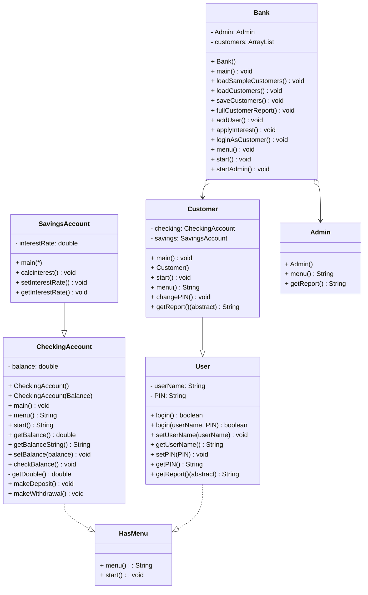

# CS121_project_9-10


## HasMenu
HasMenu Interface
```
Define an interface named HasMenu
menu() that returns a string showing options to the user
start() that runs the menu system
```

## CheckingAccount
CheckingAccount()
```
Define a class named CheckingAccount that implements HasMenu
Create a variable called balance to hold a double number

Constructor with no parameters:
  set balance to 0.0

Constructor with balance parameter:
  set balance to the given balance

Define menu method:
  return a text menu with options to exit, check balance, deposit, or withdraw

Define start method:
  create a scanner to get user input
  set keepGoing to true
  while keepGoing is true:
    show the menu and ask for a choice
    if choice is 0:
      set keepGoing to false  
    elif choice is 1:
      call checKBalance
    elif choice is 2
      call makeDeposit
    elif choice is 3:
      call makeWithdrawal
    else:
      print "Invalid option"

Define getBalance method:
  return the balance

Define getBalanceString method:
  return the balance formatted as money with two decimal places

Define setBalance method:
  set balance to the given value

Define checkBalance method:
  print "Your balance is: " + call getBalanceString

Define getDouble method:
  try to read a number from the user
  if it fails, print an error and return 0.0\

Define makeDeposit method:
  ask the user for an amount
  if the amount is positive:
    add it to balance
    print a success message
  else:
    print "Invalid deposit ammount"

Define makeWithdrawal method:
  ask the user for an amount
  if the amount is greater than 0 and less than or equal to balance:
    subtract it from balance
    print a success message
  else:
    print "Invalid withdrawal amount"
```

## SavingsAccount
SavingsAccount()
```
Define a class called SavingsAccount that extends CheckingAccount
Create a variable called interestRate to hold a double number

Constructor with no parameters:
  call the parent constructor to set balance to 0
  set interestRate to 0.01

Constructor with balance and interest rate parameters:
  call the parent constructor to set balance to the given value
  set interestRate to the given rate

Define calcInterest method:
  calculate the interest as balance times interestRate
  add interest to balance
  print how much interest was added

Define setInterestRate method:
  set interesstRate to the given value

Define getInerestRate method:
  return the interestRate
```

## User (Abstract)
User()
```
Define an abstract class named User that implements HasMenu and Serializable
Create variables userName and PIN as Strings

Define the login method with no parameters:
  set a boolean varaible result to false
  create a new scanner object to read user input
  print "Enter Username: "
  read the entered username and store it in enteredUserName
  print "Enter PIN: "
  read the entered PIN and store it in enteredPIN
  compare userName to enteredUserName and store the result in a boolean correctUser
  compare PIN to enteredPIN and store the result in a boolean correctPIN
  if both correctUser and correctPIN are false
    print "Incorrect username and PIN"
  elif correctUser is false and correctPIN is true
    print "Incorrect username"
  elif correctUser is true and corretPIN is false
    print "Incorrect PIN"
  else:
    print "Login successful"
    set result to ture
  return result

Define the login method that takes two string parameters:
  set boolean variable result to false
  if stored userName equals given userName and stored PIN equals given PIN:
    set result to true
  return result

Define setUserName method:
  set userName to the given value

Define getUserName method:
  return userName

Define setPIN method:
  set PIN to the given value

Define getPIN method:
  return PIN

Define an abstract getReport method that will be written by subclasses
```

## Customer
Customer()
```
Define a class named Customer that extends User
Create variables checking as a CheckingAccount and savings as a SavingsAccount

Constructor with no parameters:
  create a new CheckingAccount and a new SavingsAccount
  set userName to "Alice"
  set PIN to "0000"

Constructor with userName and PIN parameters:
  call the no parameter constructor
  set userName to the given userName
  set PIN to the given PIN

Define start method:
  create a scanner to get input
  set keepGoing to true
  while keepGoing is true:
    show the menu
    get the user's choice
    if choice is 0:
      set keepGoing to false
    elif choice is 1:
      call checking.start
    elif choice is 2:
      call savings.start
    elif choice is 3:
      call changePIN
    else:
      print "Invalid option"

Define menu method:
  return a text menu with options exit, checkins, savings, or change PIN

Define changePIN method:
  ask the user for a new PIN
  set PIN to the new value
  print "PIN changed successfully"

Define getReport method:
  return a string with the userName, checking balance, savings balance, and interest rate
```

## Admin
Admin()
```
Define a class named Admin that extends User
Implement the Serializable interface

Constructor with no parameters:
    call setUserName("admin")
    call setPIN("0000")

Define menu() method:
    print the following text:
    Admin Menu
    0) Exit this menu
    1) Full customer report
    2) Add user
    3) Apply interest to savings accounts
    Action:

Define start() method:
    leave empty (admin actions are handled in Bank class)

Define getReport() mehtod:
    return the string: "Admin user: " + userName
```

## Bank
Bank()
```
Define a class named Bank that implements Serializable

Create a variable admin as an Admin
Create variable customers as a CustomerList (extends ArrayList of Customer)

Constructor with no parameters:
    create a new Admin object and assign it to admin
    call loadCustomers()
    if loading fails:
        call loadSampleCustomers()
    call start()
    call saveCustomers()

Define start() method:
    create a scanner to read input
    create a boolean keepGoing and set it to true
    while keepGoing is true:
        Print the following text:
        Bank Menu
        0) Exit system
        1) Login as admin
        2) Login as customer
        Action:
        read the user choice
        if choice equals 0:
            set keepGoing to false
        elif choice equals 1:
            call startAdmin()
        elif choice equals 2:
            call loginAsCustomer()
        else:
            print "Invalid option."

Define startAdmin() method:
    print "Admin Login"
    ask for User name
    read enteredUserName
    ask for PIN
    read enteredPIN
    if admin.login(enteredUserName, enteredPIN) is true:
        create a boolean variable keepGoing and set it to true
        while keepGoing is true:
            print the admin menu using admin.menu()
            read the user choice
        if choice equals 0:
            set keepGoing to false
        elif choice equals 1:
            call fullCustomerReport()
        elif choice equals 2:
            call addUser()
        elif choice equals 3:
            call applyInterest()
        else:
            print "Invalid option."
    else:
        print "Invalid admin login."

Define fullCustomerReport() method:
    print "Full Customer Report"
    for each customer in customers:
        print customer.getReport()

Define addUser() method:
    print "Add user"
    ask for Name
    read enteredName
    ask for PIN
    read enteredPIN
    create a new Customer(enteredName, enteredPIN)
    add the new customer to the customers list
    print "User added successfully"

Define applyInterest method:
    print "Apply interest"
    for each customer in customers:
        call customer.savings.calcInterest()

Define loadSampleCustomers() method:
    create a new CustomerList
    create Customer Alice with userName "Alice" and PIN "1111"
    set Alice's checking balance to 1000
    set Alice's savings balance to 1000
    add Alice to customers list
    create and add Customer Bob with PIN "2222"
    create and add Customer Cindy with PIN "3333"
    print "Sample customers loaded"

Define saveCustomers() method:
    try to create an ObjectOutputStream using file customers.dat
    write the customers list to the stream
    close the stream
    if an error occurs:
        print "Error saving customers"

Define loadCustomers() method:
    try to open customers.dat with an ObjectInputStream
    read an object and cast it to CustomerList
    assing it to customers
    print "Customers loaded from file"
    if any errors occurs:
        print "No saved data found. Loading sample customers..."
```
